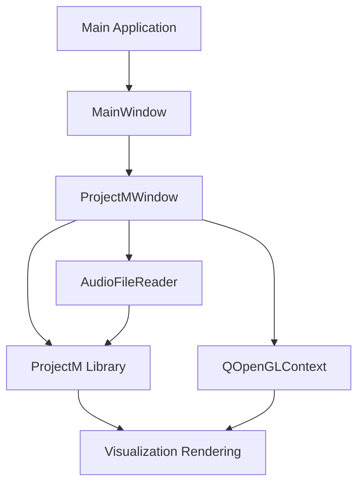
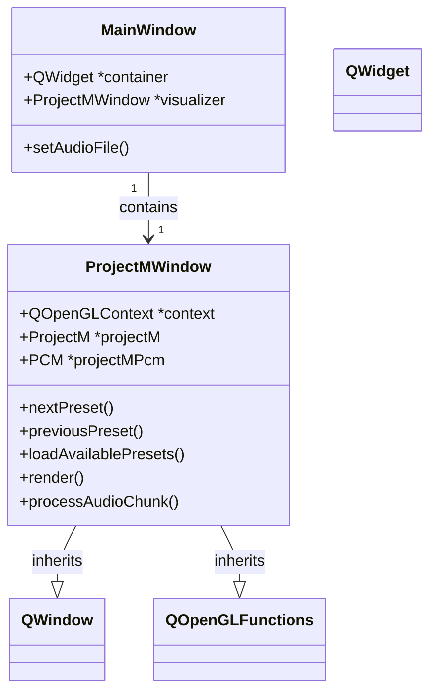
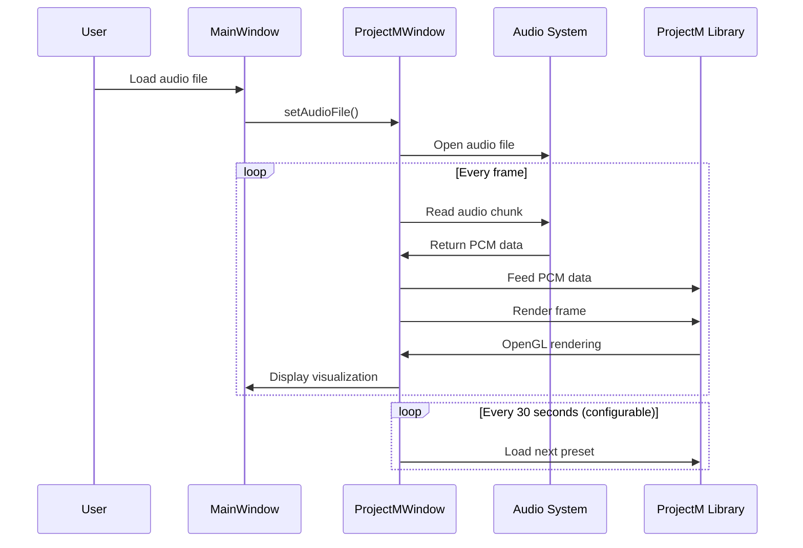

# MusicVisQT

A Qt-based music visualization application built with ProjectM integration. This application provides real-time music visualization with OpenGL rendering, automatic preset cycling, and audio playback.

## Sample (Heavilly Compressed - Poor quality)

https://github.com/user-attachments/assets/7159580c-9750-4241-aa28-9b1c8f7a9729

## Project Architecture

The application consists of a Qt GUI framework with direct OpenGL integration via QWindow for ProjectM visualization. 



### Component Breakdown



### Data Flow



## Dependencies

The project requires the following dependencies:

- **Qt 6.x**: For GUI framework and multimedia support
- **ProjectM**: For music visualization (handled via git submodule)
- **libsndfile**: For audio file reading
- **OpenGL 3.3+**: For visualization rendering

## Building from Source

### Prerequisites

#### Ubuntu/Debian

```bash
# Install basic build tools
sudo apt update
sudo apt install build-essential cmake git

# Install Qt 6
sudo apt install qt6-base-dev qt6-multimedia-dev

# Install libsndfile
sudo apt install libsndfile1-dev

# Install OpenGL development libraries
sudo apt install libgl1-mesa-dev
```

#### Fedora/RHEL

```bash
# Install basic build tools
sudo dnf install gcc-c++ cmake git

# Install Qt 6
sudo dnf install qt6-qtbase-devel qt6-qtmultimedia-devel

# Install libsndfile
sudo dnf install libsndfile-devel

# Install OpenGL development libraries
sudo dnf install mesa-libGL-devel
```

#### macOS

```bash
# Install Homebrew if not already installed
/bin/bash -c "$(curl -fsSL https://raw.githubusercontent.com/Homebrew/install/HEAD/install.sh)"

# Install dependencies
brew install cmake
brew install qt@6
brew install libsndfile
```

#### Windows

1. Install [Visual Studio](https://visualstudio.microsoft.com/) with C++ development tools
2. Install [CMake](https://cmake.org/download/)
3. Install [Qt 6](https://www.qt.io/download)
4. Install [vcpkg](https://github.com/microsoft/vcpkg) and use it to install libsndfile:
   ```
   vcpkg install libsndfile:x64-windows
   ```

### Clone the Repository

```bash
# Clone the repository with submodules
git clone --recursive https://github.com/Ether-G/musicvisqt.git
cd musicvisqt

# If you've already cloned without --recursive, run:
git submodule update --init --recursive
```

### Build the Project

#### Linux/macOS

```bash
# Create a build directory
mkdir build
cd build

# Configure the project
# (Replace the Qt path with your Qt installation path if needed)
cmake .. -DCMAKE_PREFIX_PATH=/path/to/qt/6.9.0/gcc_64

# Build the project
cmake --build . -j $(nproc)
```

#### Windows (Command Line)

```bash
mkdir build
cd build

# Configure the project (adjust paths as needed)
cmake .. -DCMAKE_PREFIX_PATH=C:/Qt/6.9.0/msvc2019_64 -DCMAKE_TOOLCHAIN_FILE=C:/vcpkg/scripts/buildsystems/vcpkg.cmake

# Build the project
cmake --build . --config Release
```

### Running the Application

```bash
# From the build directory
./QtProjectMVisualizer /path/to/audio_file.mp3
```

## Usage

- **Right Arrow / N key**: Next visualization preset
- **Left Arrow / P key**: Previous visualization preset
- Presets will automatically cycle every 30 seconds by default

## Project Structure

```
musicvisqt/
├── CMakeLists.txt           # Main build configuration
├── main.cpp                 # Application entry point
├── mainwindow.cpp           # Main window implementation
├── mainwindow.h             # Main window header
├── mainwindow.ui            # Qt Designer UI file
├── projectmwindow.cpp       # ProjectM OpenGL window implementation
├── projectmwindow.h         # ProjectM OpenGL window header
├── presets/                 # Visualization presets
│   ├── Presets/             # .milk preset files
│   └── Textures/            # Texture files for visualizations
└── external/                # External dependencies
    └── projectm/            # ProjectM library (git submodule)
```

## Troubleshooting

### Black Screen Issues

If you see a black screen with no visualization:

1. Check the console output for any OpenGL errors
2. Verify your graphics drivers support OpenGL 3.3+
3. Ensure the preset path is correct and contains valid .milk files
4. Check that texture files are found in the Textures directory

### Audio Issues

If the visualization doesn't respond to audio:

1. Ensure the audio file format is supported (MP3, WAV, FLAC, etc.)
2. Check the console for any "Audio chunk max amplitude" messages to verify audio processing
3. Try different audio files with varying characteristics

## Contributing

Contributions are welcome! Please feel free to submit a Pull Request.

1. Fork the repository
2. Create your feature branch (`git checkout -b feature/amazing-feature`)
3. Commit your changes (`git commit -m 'Add some amazing feature'`)
4. Push to the branch (`git push origin feature/amazing-feature`)
5. Open a Pull Request

## License

This project is licensed under the MIT License - see the LICENSE file for details.

## Acknowledgments

- [ProjectM](https://github.com/projectM-visualizer/projectm) for the visualization engine
- [Qt](https://www.qt.io/) for the application framework
- [libsndfile](http://www.mega-nerd.com/libsndfile/) for audio file reading
